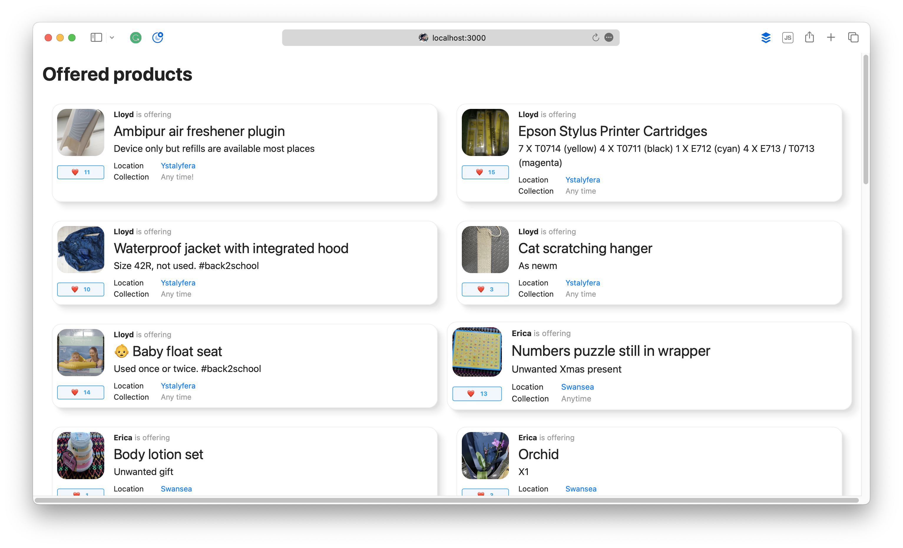

# Sample product liker app 

This is an example Rails app which displays a list of products being offered by users, and allows anybody using the
app to like a product.

# Installation and setup

To install and run on a development machine, you will need the following to already be installed:

* Ruby 3.2 or above
* Bundler 2.4.12 or above
* SQLite
* Google Chrome (for running system tests)

Installing the above is beyond the scope of this document. If you are using a Mac, I recommend using `homebrew` to 
manage your dependencies.

To install the app, clone the repository from GitHub, then run the setup script to install the dependencies and
setup the database:

```shell
git clone https://github.com/scottmatthewman/product_liker.git
bin/setup
```

# Running the app

To run the app, use the following command:

```shell
bin/rails server
```

This will start the app running on port 3000. You can then access the app at http://localhost:3000.

You should see something like this:



The products are arranged in a grid that automatically adjusts the number of columns to fit the width of the browser.

Under the photo associated with each product, there is a "Like" button. Clicking this will add a like to the product.
Likes are not associated with any particular user, but are persisted between sessions.

# Running the tests

To run the tests, use the following command:

```shell
bin/rspec
```

In order to test JavaScript functionality (.e.g, clicking the "Like" button), the tests use the Chrome browser.
The first time you run these tests, the test suite will attempt to download any necessary drivers which may take a
while. Any drivers are cached for future use.

By default, Chrome is run in "headless" mode, so you will not see the browser window appear. If you want to see the
browser window, you can adjust the setting in [`spec/initializers/webdrivers.rb`](./spec/initializers/webdrivers.rb).

```shell
  config.before(:each, js: true, type: :system) do
    # Replace with :selenium_chrome to see the browser during tests
    driven_by(:selenium_chrome_headless)
  end
```

If any of your tests fail even in headless mode, the RSpec output will include a link to a screenshot which may help
diagnose the problem.

If you are writing new system tests, add the `:js` or `js: true` flag to the test definition to ensure that they run
in the Chrome browser. (For an example, see [`liking_products_spec.rb`](./spec/system/liking_products_spec.rb)). 

By default, system tests use an internal browser that does not support JavaScript. The
internal browser is much quicker, so it's worth only using Chrome when you need to test JavaScript support.
